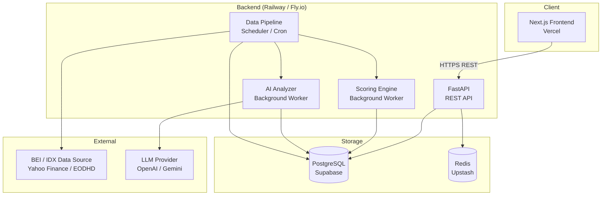
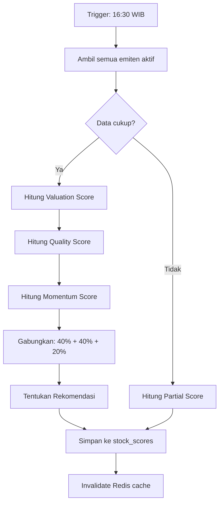
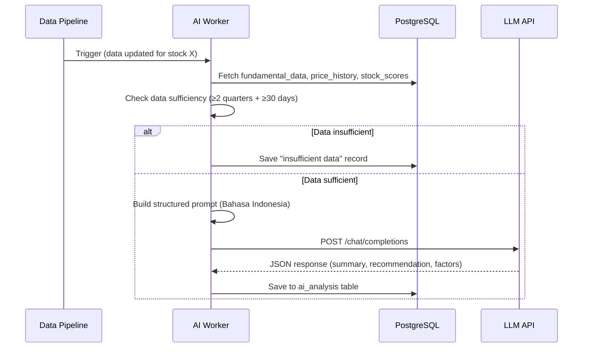
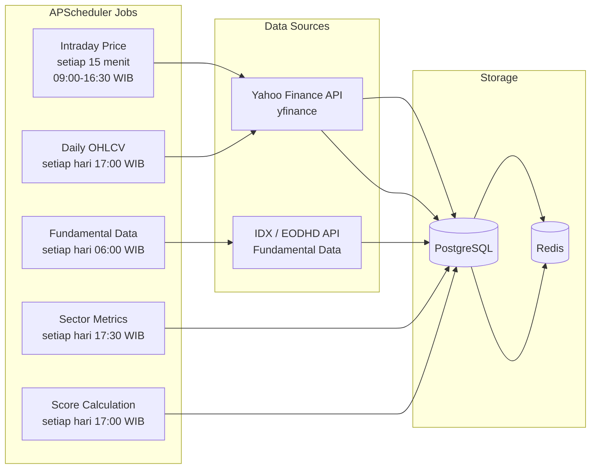
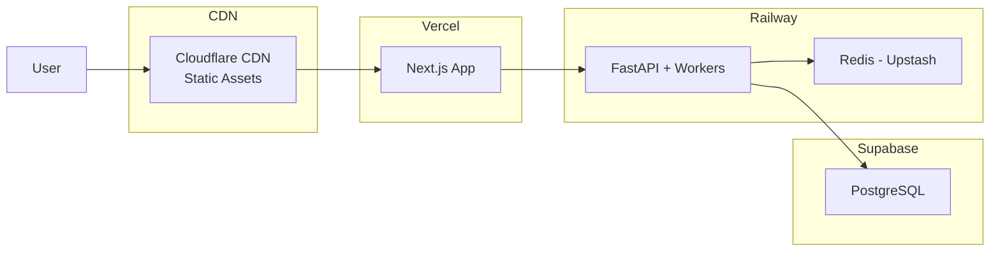

# Design Document: BEI Stock Dashboard

## Overview

BEI Stock Dashboard adalah aplikasi web full-stack untuk analisa saham Bursa Efek Indonesia. Sistem ini terdiri dari frontend Next.js, backend FastAPI (Python), PostgreSQL sebagai database utama, Redis untuk caching, dan pipeline data otomatis untuk integrasi data BEI. AI Analyzer menggunakan LLM (OpenAI/Gemini) untuk menghasilkan ringkasan analisa saham dalam Bahasa Indonesia.

Arsitektur mengikuti pola layered monorepo dengan pemisahan jelas antara data ingestion, business logic, dan presentation layer.

---

## Architecture



### Komponen Utama

- **Frontend (Next.js)**: App Router, Server Components untuk SSR, Client Components untuk interaktivitas. Di-deploy ke Vercel.
- **Backend (FastAPI)**: REST API stateless, JWT auth, rate limiting via middleware. Di-deploy ke Railway.
- **Scoring Engine**: Python worker yang berjalan sebagai background task setelah market close (16:30 WIB).
- **AI Analyzer**: Python worker yang memanggil LLM API, dipicu setelah data diperbarui.
- **Data Pipeline**: APScheduler jobs untuk polling data harga intraday (15 menit) dan fundamental data.
- **PostgreSQL (Supabase)**: Database utama untuk semua data persisten.
- **Redis (Upstash)**: Cache untuk harga terkini, hasil scoring, dan rate limiting counters.

---

## Components and Interfaces

### Frontend Components

```
src/
├── app/
│   ├── (auth)/
│   │   ├── login/page.tsx
│   │   └── register/page.tsx
│   ├── dashboard/page.tsx          # Halaman utama / ranking
│   ├── stock/[code]/page.tsx       # Stock Profile
│   ├── watchlist/page.tsx
│   └── layout.tsx
├── components/
│   ├── search/
│   │   ├── SearchBar.tsx           # Input + dropdown autocomplete
│   │   └── SearchResults.tsx
│   ├── stock/
│   │   ├── StockHeader.tsx         # Nama, kode, harga, perubahan
│   │   ├── MetricsCard.tsx         # PER, PBV, ROE, Div Yield
│   │   ├── PriceChart.tsx          # Recharts / ECharts OHLCV
│   │   ├── ScoreCard.tsx           # Score + breakdown + rekomendasi
│   │   ├── AnalysisTab.tsx         # Valuasi, Kualitas, Risiko
│   │   ├── AIAnalysisTab.tsx       # AI Analyzer output
│   │   └── SectorComparison.tsx    # Perbandingan vs median sektor
│   ├── ranking/
│   │   ├── RankingTable.tsx        # Sortable, paginated table
│   │   └── SectorFilter.tsx
│   ├── watchlist/
│   │   ├── WatchlistTable.tsx
│   │   └── AddToWatchlistButton.tsx
│   └── ui/                         # Shared: Button, Badge, Spinner, etc.
└── lib/
    ├── api.ts                      # Axios/fetch wrapper
    ├── auth.ts                     # JWT helpers, NextAuth config
    └── hooks/                      # useSearch, useWatchlist, useStock
```

### Backend Modules

```
app/
├── main.py
├── api/
│   ├── auth.py          # /auth/*
│   ├── stocks.py        # /stocks/*
│   ├── watchlist.py     # /watchlist/*
│   ├── ranking.py       # /ranking/*
│   └── analysis.py      # /analysis/*
├── services/
│   ├── auth_service.py
│   ├── stock_service.py
│   ├── scoring_engine.py
│   ├── ai_analyzer.py
│   └── data_pipeline.py
├── models/              # SQLAlchemy ORM models
├── schemas/             # Pydantic request/response schemas
├── middleware/
│   ├── rate_limiter.py
│   └── auth_middleware.py
└── workers/
    ├── scheduler.py     # APScheduler setup
    ├── score_worker.py
    └── ai_worker.py
```

### API Endpoints

#### Auth (`/api/v1/auth`)

| Method | Path | Deskripsi |
|--------|------|-----------|
| POST | `/register` | Registrasi user baru |
| POST | `/login` | Login, return JWT + refresh token |
| POST | `/refresh` | Refresh access token |
| POST | `/logout` | Revoke refresh token |
| GET | `/verify-email` | Verifikasi email via token |

#### Stocks (`/api/v1/stocks`)

| Method | Path | Deskripsi |
|--------|------|-----------|
| GET | `/search?q={query}` | Autocomplete pencarian saham |
| GET | `/` | Daftar semua saham (dengan filter & pagination) |
| GET | `/{code}` | Detail profil emiten |
| GET | `/{code}/price-history?range={1w\|1m\|3m\|6m\|1y\|5y}` | Data harga historis |
| GET | `/{code}/fundamentals` | Data fundamental lengkap |
| GET | `/{code}/score` | Score + breakdown |
| GET | `/{code}/sector-comparison` | Perbandingan vs median sektor |
| GET | `/sectors` | Daftar semua sektor |

#### Watchlist (`/api/v1/watchlist`) — requires auth

| Method | Path | Deskripsi |
|--------|------|-----------|
| GET | `/` | Ambil watchlist user |
| POST | `/` | Tambah saham ke watchlist |
| DELETE | `/{code}` | Hapus saham dari watchlist |

#### Ranking (`/api/v1/ranking`)

| Method | Path | Deskripsi |
|--------|------|-----------|
| GET | `/` | Daftar ranking saham (sort, filter, paginate) |

#### Analysis (`/api/v1/analysis`)

| Method | Path | Deskripsi |
|--------|------|-----------|
| GET | `/{code}/ai` | Ambil hasil AI analysis terbaru |
| POST | `/{code}/ai/refresh` | Trigger ulang AI analysis (rate-limited) |

---

## Data Models

### Database Schema (PostgreSQL)

```sql
-- Users
CREATE TABLE users (
    id          UUID PRIMARY KEY DEFAULT gen_random_uuid(),
    email       VARCHAR(255) UNIQUE NOT NULL,
    name        VARCHAR(100) NOT NULL,
    password_hash VARCHAR(255) NOT NULL,  -- bcrypt cost 12
    email_verified BOOLEAN DEFAULT FALSE,
    is_active   BOOLEAN DEFAULT TRUE,
    created_at  TIMESTAMPTZ DEFAULT NOW(),
    updated_at  TIMESTAMPTZ DEFAULT NOW()
);

-- Refresh tokens (untuk revocation)
CREATE TABLE refresh_tokens (
    id          UUID PRIMARY KEY DEFAULT gen_random_uuid(),
    user_id     UUID NOT NULL REFERENCES users(id) ON DELETE CASCADE,
    token_hash  VARCHAR(255) NOT NULL,
    expires_at  TIMESTAMPTZ NOT NULL,
    revoked     BOOLEAN DEFAULT FALSE,
    created_at  TIMESTAMPTZ DEFAULT NOW()
);

-- Login attempt tracking (untuk account lockout)
CREATE TABLE login_attempts (
    id          SERIAL PRIMARY KEY,
    ip_address  INET NOT NULL,
    attempted_at TIMESTAMPTZ DEFAULT NOW(),
    success     BOOLEAN NOT NULL
);

-- Stocks (master data emiten)
CREATE TABLE stocks (
    id          SERIAL PRIMARY KEY,
    code        VARCHAR(10) UNIQUE NOT NULL,   -- e.g. BBCA
    name        VARCHAR(255) NOT NULL,
    sector      VARCHAR(100),
    sub_sector  VARCHAR(100),
    description TEXT,
    listing_date DATE,
    is_active   BOOLEAN DEFAULT TRUE,
    created_at  TIMESTAMPTZ DEFAULT NOW(),
    updated_at  TIMESTAMPTZ DEFAULT NOW()
);

-- Harga terkini (diperbarui setiap 15 menit)
CREATE TABLE stock_prices (
    id          SERIAL PRIMARY KEY,
    stock_id    INTEGER NOT NULL REFERENCES stocks(id),
    price       NUMERIC(15,2) NOT NULL,
    open        NUMERIC(15,2),
    high        NUMERIC(15,2),
    low         NUMERIC(15,2),
    close       NUMERIC(15,2),
    volume      BIGINT,
    change_nominal NUMERIC(15,2),
    change_pct  NUMERIC(8,4),
    recorded_at TIMESTAMPTZ NOT NULL,
    created_at  TIMESTAMPTZ DEFAULT NOW()
);

-- Harga historis OHLCV (daily)
CREATE TABLE price_history (
    id          SERIAL PRIMARY KEY,
    stock_id    INTEGER NOT NULL REFERENCES stocks(id),
    date        DATE NOT NULL,
    open        NUMERIC(15,2),
    high        NUMERIC(15,2),
    low         NUMERIC(15,2),
    close       NUMERIC(15,2) NOT NULL,
    volume      BIGINT,
    adjusted_close NUMERIC(15,2),
    UNIQUE(stock_id, date)
);

-- Data fundamental (per kuartal / tahunan)
CREATE TABLE fundamental_data (
    id              SERIAL PRIMARY KEY,
    stock_id        INTEGER NOT NULL REFERENCES stocks(id),
    period_type     VARCHAR(10) NOT NULL,  -- 'Q1','Q2','Q3','Q4','Annual'
    period_year     INTEGER NOT NULL,
    -- Valuasi
    per             NUMERIC(10,4),
    pbv             NUMERIC(10,4),
    ev_ebitda       NUMERIC(10,4),
    -- Profitabilitas
    roe             NUMERIC(10,4),
    roa             NUMERIC(10,4),
    net_profit_margin NUMERIC(10,4),
    -- Likuiditas & Solvabilitas
    current_ratio   NUMERIC(10,4),
    debt_to_equity  NUMERIC(10,4),
    -- Dividen
    dividend_yield  NUMERIC(10,4),
    dividend_per_share NUMERIC(15,4),
    -- Teknikal
    beta            NUMERIC(10,4),
    volatility_30d  NUMERIC(10,4),
    -- Raw financials
    revenue         BIGINT,
    net_income      BIGINT,
    total_assets    BIGINT,
    total_equity    BIGINT,
    total_debt      BIGINT,
    ebitda          BIGINT,
    eps             NUMERIC(15,4),
    book_value_per_share NUMERIC(15,4),
    published_at    TIMESTAMPTZ,
    created_at      TIMESTAMPTZ DEFAULT NOW(),
    UNIQUE(stock_id, period_type, period_year)
);

-- Skor saham
CREATE TABLE stock_scores (
    id              SERIAL PRIMARY KEY,
    stock_id        INTEGER NOT NULL REFERENCES stocks(id),
    score           NUMERIC(5,2) NOT NULL,       -- 0-100
    valuation_score NUMERIC(5,2),                -- bobot 40%
    quality_score   NUMERIC(5,2),                -- bobot 40%
    momentum_score  NUMERIC(5,2),                -- bobot 20%
    is_partial      BOOLEAN DEFAULT FALSE,
    recommendation  VARCHAR(20),                 -- 'Beli Kuat','Beli','Tahan','Jual'
    score_factors   JSONB,                       -- breakdown faktor pendukung
    calculated_at   TIMESTAMPTZ NOT NULL,
    created_at      TIMESTAMPTZ DEFAULT NOW()
);

-- Watchlist
CREATE TABLE watchlists (
    id          SERIAL PRIMARY KEY,
    user_id     UUID NOT NULL REFERENCES users(id) ON DELETE CASCADE,
    stock_id    INTEGER NOT NULL REFERENCES stocks(id),
    added_at    TIMESTAMPTZ DEFAULT NOW(),
    UNIQUE(user_id, stock_id)
);

-- AI Analysis results
CREATE TABLE ai_analysis (
    id              SERIAL PRIMARY KEY,
    stock_id        INTEGER NOT NULL REFERENCES stocks(id),
    summary         TEXT NOT NULL,
    recommendation  VARCHAR(20) NOT NULL,
    valuation_analysis TEXT,
    quality_analysis   TEXT,
    momentum_analysis  TEXT,
    supporting_factors JSONB,                    -- array of 3+ faktor
    data_sufficiency   BOOLEAN DEFAULT TRUE,
    missing_data_info  TEXT,
    model_used      VARCHAR(100),
    prompt_version  VARCHAR(20),
    generated_at    TIMESTAMPTZ NOT NULL,
    created_at      TIMESTAMPTZ DEFAULT NOW()
);

-- Sektor median metrics (dihitung harian)
CREATE TABLE sector_metrics (
    id              SERIAL PRIMARY KEY,
    sector          VARCHAR(100) NOT NULL,
    median_per      NUMERIC(10,4),
    median_pbv      NUMERIC(10,4),
    median_roe      NUMERIC(10,4),
    median_div_yield NUMERIC(10,4),
    stock_count     INTEGER,
    calculated_at   DATE NOT NULL,
    UNIQUE(sector, calculated_at)
);

-- Corporate actions
CREATE TABLE corporate_actions (
    id          SERIAL PRIMARY KEY,
    stock_id    INTEGER NOT NULL REFERENCES stocks(id),
    action_type VARCHAR(50) NOT NULL,  -- 'dividend','split','rights_issue'
    action_date DATE NOT NULL,
    details     JSONB,
    announced_at TIMESTAMPTZ,
    created_at  TIMESTAMPTZ DEFAULT NOW()
);

-- Data source health tracking
CREATE TABLE data_source_health (
    id          SERIAL PRIMARY KEY,
    source_name VARCHAR(100) NOT NULL,
    is_healthy  BOOLEAN NOT NULL,
    last_success TIMESTAMPTZ,
    last_failure TIMESTAMPTZ,
    error_message TEXT,
    checked_at  TIMESTAMPTZ DEFAULT NOW()
);
```

### Indexes

```sql
CREATE INDEX idx_stocks_code ON stocks(code);
CREATE INDEX idx_stocks_sector ON stocks(sector);
CREATE INDEX idx_stock_scores_score ON stock_scores(score DESC);
CREATE INDEX idx_stock_scores_stock_id ON stock_scores(stock_id);
CREATE INDEX idx_price_history_stock_date ON price_history(stock_id, date DESC);
CREATE INDEX idx_fundamental_data_stock_period ON fundamental_data(stock_id, period_year DESC);
CREATE INDEX idx_watchlists_user ON watchlists(user_id);
CREATE INDEX idx_ai_analysis_stock ON ai_analysis(stock_id, generated_at DESC);
CREATE INDEX idx_login_attempts_ip ON login_attempts(ip_address, attempted_at DESC);
```

---

## Scoring Engine Design

Scoring Engine berjalan sebagai background worker setelah market close (16:30 WIB).



### Komponen Skor

**Valuation Score (40%)** — skor rendah = valuasi murah (lebih baik):
- PER vs median sektor: skor lebih tinggi jika PER di bawah median
- PBV vs median sektor: skor lebih tinggi jika PBV di bawah median
- EV/EBITDA vs historis 3 tahun emiten

**Quality Score (40%)** — skor tinggi = kualitas fundamental baik:
- ROE: skor proporsional terhadap nilai ROE
- Net Profit Margin: skor proporsional
- Debt-to-Equity: skor lebih tinggi jika DER rendah
- Current Ratio: skor lebih tinggi jika CR > 1.5

**Momentum Score (20%)** — skor tinggi = momentum positif:
- Perubahan harga 1 bulan vs sektor
- Perubahan harga 3 bulan vs sektor
- Volume relatif vs rata-rata 20 hari

### Rekomendasi

| Score | Label |
|-------|-------|
| ≥ 75 | Beli Kuat |
| 60–74 | Beli |
| 40–59 | Tahan |
| < 40 | Jual |

---

## AI Analyzer Design



### Prompt Structure

Prompt dikirim ke LLM dalam format terstruktur:

```
Kamu adalah analis saham profesional Indonesia. Analisa saham berikut berdasarkan data yang diberikan.

Data Saham: {code} - {name}
Sektor: {sector}

Data Fundamental (kuartal terakhir):
- PER: {per} (median sektor: {sector_per})
- PBV: {pbv} (median sektor: {sector_pbv})
- ROE: {roe}%
- DER: {der}
- Net Profit Margin: {npm}%
- Dividend Yield: {div_yield}%

Momentum Teknikal:
- Perubahan 1 bulan: {change_1m}%
- Perubahan 3 bulan: {change_3m}%
- Volatilitas 30 hari: {vol_30d}%

Skor Internal: {score}/100

Berikan analisa dalam format JSON:
{
  "recommendation": "Beli Kuat|Beli|Tahan|Jual",
  "summary": "ringkasan 2-3 kalimat",
  "valuation_analysis": "...",
  "quality_analysis": "...",
  "momentum_analysis": "...",
  "supporting_factors": ["faktor 1", "faktor 2", "faktor 3"]
}
```

### Caching Strategy

- Hasil AI analysis disimpan di `ai_analysis` table
- Redis cache key: `ai_analysis:{stock_code}` dengan TTL 6 jam
- Jika data saham diperbarui, cache di-invalidate dan AI worker di-trigger
- User dapat melihat analisa terakhir tanpa menunggu proses baru

---

## Data Pipeline Design



### Health Monitoring

- Setiap job mencatat status ke `data_source_health`
- Jika sumber data gagal > 30 menit, flag `is_healthy = false`
- API membaca flag ini dan menyertakan `data_warning` di response header
- Frontend menampilkan banner peringatan jika `data_warning` ada

---

## Deployment Architecture



### Environment Variables

```
# Backend
DATABASE_URL=postgresql://...
REDIS_URL=redis://...
JWT_SECRET=...
JWT_REFRESH_SECRET=...
OPENAI_API_KEY=...  # atau GEMINI_API_KEY
EODHD_API_KEY=...
SMTP_HOST=...

# Frontend
NEXT_PUBLIC_API_URL=https://api.bei-dashboard.com
NEXTAUTH_SECRET=...
NEXTAUTH_URL=...
```

---

